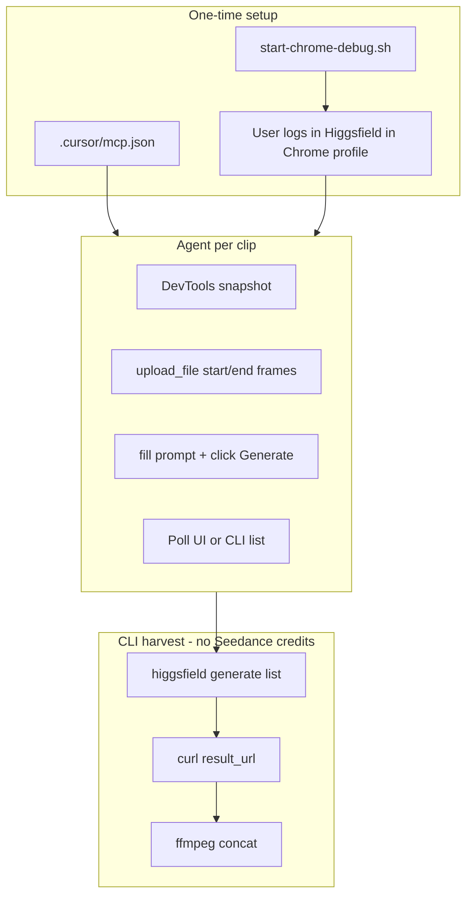

# Browser Seedance via Chrome DevTools MCP

## Goal

Replace **CLI Seedance generation** (which billed **52.5 credits/clip** even with `--mode fast`) with **browser-based generation** on the **Enhanced Seedance 2.0 Fast / UNLIMITED** tier, while the agent automates the UI through the **official Chrome DevTools MCP** (`chrome-devtools-mcp`).

**Scope:** Seedance clips only — reuse existing frames in [`rwe-explainer/frames/`](rwe-explainer/frames/). CLI still handles harvest + stitch.

---

## Why Chrome DevTools MCP (not computerUse alone)

| Approach | Pros | Cons |
|---|---|---|
| **Chrome DevTools MCP** (chosen) | Programmatic `navigate_page`, `click`, `fill`, `upload_file`, `take_screenshot`; repeatable; versionable runbook | Requires MCP setup + Chrome debug port |
| computerUse (Desktop pane) | No MCP config | Fragile coordinates; harder to repeat; no DOM snapshots |
| Manual browser + CLI harvest | Most reliable | Not agent-driven |

The official MCP package exposes the tools we need for Higgsfield: file upload, form fill, navigation, and screenshots for verification. See [tool reference](https://github.com/ChromeDevTools/chrome-devtools-mcp/blob/main/docs/tool-reference.md).

---

## Architecture



**Key insight:** Browser and CLI share the same Higgsfield account. After a browser job completes, `higgsfield generate list --video` returns the job with `result_url` — agent downloads without re-generating via CLI.

---

## Phase 1 — Repo MCP configuration (agent implements after approval)

### 1.1 Add [`.cursor/mcp.json`](.cursor/mcp.json)

Cloud agents **only** load project-level MCP config (not `~/.cursor/mcp.json`). Use **attach mode** so the agent controls the same Chrome window you log into on the Desktop pane:

```json
{
  "mcpServers": {
    "chrome-devtools": {
      "command": "npx",
      "args": [
        "-y",
        "chrome-devtools-mcp@latest",
        "--slim",
        "--browser-url=http://127.0.0.1:9222",
        "--no-usage-statistics"
      ]
    }
  }
}
```

**Why `--slim`:** Basic browser automation only (navigate, click, fill, upload, screenshot) — sufficient for Higgsfield and lighter than full DevTools/performance tooling.

**Why `--browser-url`:** MCP attaches to a **running** Chrome instance instead of launching a separate headless browser (which would not have your login session).

**Why not launch Chrome from MCP directly:** A fresh MCP-launched profile would not have your Higgsfield cookies unless we point `--user-data-dir` at a persisted directory (Alternative B below).

### 1.2 Add [`.cursor/scripts/start-chrome-debug.sh`](.cursor/scripts/start-chrome-debug.sh)

Launch Chrome on the VM Desktop with remote debugging + a **dedicated persisted profile**:

```bash
#!/usr/bin/env bash
PROFILE="${HOME}/.config/chrome-higgsfield-profile"
mkdir -p "$PROFILE"
google-chrome \
  --remote-debugging-port=9222 \
  --user-data-dir="$PROFILE" \
  --no-first-run \
  --no-default-browser-check \
  "https://higgsfield.ai" &
```

### 1.3 Update [`.cursor/environment.json`](.cursor/environment.json)

Add persisted Chrome profile alongside existing Higgsfield CLI credentials:

```json
"persistedDirectories": [
  "/home/ubuntu/.config/higgsfield",
  "/home/ubuntu/.config/chrome-higgsfield-profile"
]
```

Also ensure Node is on PATH for `npx` (already available at `/exec-daemon/npx`; may add to `env.PATH` if MCP fails to resolve it).

### 1.4 Prerequisites already on VM

- `google-chrome` at `/usr/local/bin/google-chrome`
- Node.js v22 + `npx`
- No extra apt packages required for MCP itself

---

## Phase 2 — User actions (before agent can automate)

These steps require **you** (cannot be fully automated in plan mode):

1. **Merge / pull** the branch that adds `.cursor/mcp.json` and scripts (or approve plan execution).
2. **Restart the cloud agent** (or start a new session) so Cursor loads the new MCP server.
3. **Verify MCP** — ask the agent: "What MCP tools do you have?" — should list `navigate_page`, `click`, `upload_file`, `take_screenshot`, etc.
4. **Open Desktop pane** and run:
   ```bash
   bash .cursor/scripts/start-chrome-debug.sh
   ```
5. **Log into Higgsfield** in that Chrome window (`subscriptions@weguide.health`).
6. Confirm **Enhanced Seedance 2.0 Fast** shows **UNLIMITED** in the model picker.
7. Tell the agent: "Chrome is ready, proceed with scene 1."

**Session persistence:** Login cookies live in `~/.config/chrome-higgsfield-profile` (persisted across cloud sessions). You should not need to re-login every time unless cookies expire.

**Important:** Only one Chrome instance can bind to port 9222. Close other debug Chrome instances before starting.

---

## Phase 3 — Agent automation runbook (DevTools MCP)

Document in [`rwe-explainer/BROWSER-SEEDANCE.md`](rwe-explainer/BROWSER-SEEDANCE.md). High-level flow per scene:

1. **`navigate_page`** → Higgsfield video generation page (Seedance 2.0 / Enhanced Fast).
2. **`take_screenshot` + snapshot** → confirm logged in and model selected.
3. **`upload_file`** → start frame PNG (`rwe-explainer/frames/sceneXX-start.png`).
4. **`upload_file`** → end frame PNG.
5. **`fill` / `type_text`** → motion-only prompt (from [`.cursor/plans/rwe_explainer_video_c8488d5e.plan.md`](.cursor/plans/rwe_explainer_video_c8488d5e.plan.md)).
6. Set UI controls: **15s**, **16:9**, **720p**, **Enhanced Seedance 2.0 Fast**.
7. **`click`** Generate / Create.
8. **Wait** for completion (poll UI snapshot or `higgsfield generate list --video` every 30s).
9. **Harvest via CLI** (no second generation):
   ```bash
   higgsfield generate list --video --size 5 --json
   curl -fsSL "<result_url>" -o rwe-explainer/videos/scene0N.mp4
   ```

### Per-scene inputs (reuse existing frames)

| Scene | Start | End | Prompt source |
|---|---|---|---|
| 1 | `frames/scene01-start.png` | `frames/scene01-end.png` | Plan → Scene 1 Seedance block |
| 2 | `frames/scene01-end.png` | `frames/scene02-end.png` | Plan → Scene 2 block |
| 3 | `frames/scene02-end.png` | `frames/scene03-end.png` | Plan → Scene 3 block |

### Credit verification after pilot (scene 1)

```bash
higgsfield account status
higgsfield account transactions --size 10 --json
```

**Success criterion:** No new `Seedance 2.0` **spend** line for the browser-created job. CLI-created jobs showed `-52.5` per clip earlier.

---

## Phase 4 — Harvest + stitch scripts

Add [`rwe-explainer/harvest-videos.sh`](rwe-explainer/harvest-videos.sh):

- Accept optional job IDs or auto-pick latest N completed Seedance jobs from `higgsfield generate list --video`.
- Download to `rwe-explainer/videos/scene01.mp4` etc.
- Idempotent: skip if file already exists and non-empty.

Keep existing ffmpeg concat from [`rwe-explainer/run-plan.sh`](rwe-explainer/run-plan.sh) (Step 3) or extract to `run-plan-stitch.sh`.

Update [`rwe-explainer/run-plan.sh`](rwe-explainer/run-plan.sh):

```bash
run-plan.sh --videos browser   # frames skipped if exist; expect browser jobs + harvest
run-plan.sh --videos cli       # fallback (--mode fast)
```

---

## Phase 5 — Documentation

Update [`AGENTS.md`](AGENTS.md) with:

- How to start debug Chrome (`start-chrome-debug.sh`)
- MCP requirement (`.cursor/mcp.json` must be committed for cloud agents)
- Browser vs CLI Seedance (credits vs unlimited tier)
- Harvest commands after browser generation
- Troubleshooting: MCP not visible → restart agent; port 9222 in use → kill old Chrome

Log changes in [`changelog.md`](changelog.md).

---

## Alternative: MCP launches Chrome directly (no Desktop attach)

If attach mode is flaky, configure MCP to launch Chrome with the persisted profile:

```json
{
  "mcpServers": {
    "chrome-devtools": {
      "command": "npx",
      "args": [
        "-y",
        "chrome-devtools-mcp@latest",
        "--slim",
        "--user-data-dir=${userHome}/.config/chrome-higgsfield-profile",
        "--viewport=1280x720"
      ]
    }
  }
}
```

**Tradeoff:** Agent-launched Chrome may not appear on Desktop pane; login must happen once in that profile (agent navigates to login page, you enter credentials via Desktop if needed). Attach mode is preferred for interactive login.

---

## Risks and mitigations

| Risk | Mitigation |
|---|---|
| MCP not loaded until agent restart | Document "restart agent after merging mcp.json" |
| Higgsfield UI changes break selectors | Snapshot-driven uids (not hardcoded coords); update BROWSER-SEEDANCE.md |
| Port 9222 conflict | `start-chrome-debug.sh` checks/kills stale process |
| Browser job still bills credits | Verify with `account transactions`; abort CLI Seedance if browser is not free |
| NSFW false positives | Retry in browser (same as CLI experience) |
| File upload limits in UI | Use `upload_file` with absolute paths under `/workspace/rwe-explainer/frames/` |

---

## Execution order (after you approve)

1. Add `.cursor/mcp.json`, `start-chrome-debug.sh`, persist Chrome profile in `environment.json`.
2. Add `BROWSER-SEEDANCE.md`, `harvest-videos.sh`, `--videos browser` flag.
3. Commit + push on branch `cursor/chrome-devtools-seedance-d5c7`.
4. **You:** restart agent, start debug Chrome, log into Higgsfield.
5. **Agent:** DevTools MCP pilot scene 1 → verify credits → scenes 2–3 → stitch.
6. Update AGENTS.md; open PR with setup instructions.

**Not in scope:** Chrome DevTools MCP in your **local** Cursor (optional — same `.cursor/mcp.json` works locally if you run debug Chrome on your machine).

---

## What you need to do now

1. **Approve this plan** (or say "execute the plan").
2. After implementation merges, **restart the cloud agent** so MCP loads.
3. Run `bash .cursor/scripts/start-chrome-debug.sh` in Desktop pane and **log into Higgsfield**.
4. Confirm MCP tools are visible, then ask the agent to run scene 1.
