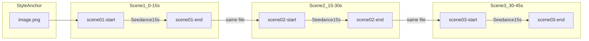

# RWE Explainer Video — Script + First 45s Seedance Plan

## Style lock (from [image.png](image.png))

All frames share this visual DNA — **Clean SaaS explainer meets isometric 3D diorama**:

| Element | Spec |
|---|---|
| World | Miniature tilt-shift diorama; pink/terracotta sandy ground, sage-green grass islands, light desaturated blue rivers/paths |
| Figures | Tiny simplified 3D people for scale (no detailed faces) |
| UI | Floating white cards with soft shadow; **Inter-style clean sans-serif** typography (user override vs serif in reference) |
| Lighting | Soft diffused daylight, gentle shadows, no harsh contrast |
| Camera | Isometric ~30° angle, wide 16:9, airy negative space |
| Mood | Calm, trustworthy healthcare — purposeful motion, not decorative |

Keep [image.png](image.png) as the style anchor. Pass it to GPT Image 2 via `--image image.png` on every frame generation for consistency.

---

## Voiceover script — full blog (~3:30 total)

**Pacing:** 140 WPM (healthcare explainer standard). ~35 words per 15s block.

### Scene map (12 beats matching your storyboard)

| Time | Visual beat | VO |
|---|---|---|
| **0:00–0:15** | Title landscape + definition hill | What is real world evidence? RWE is clinical insight built from healthcare data collected outside a conventional randomised controlled trial — from electronic health records and claims to wearables and patient apps. |
| **0:15–0:30** | RWD ingredients → RWE dish | Real world data is the ingredient. Real world evidence is the dish. RWD is raw: records, signals, survey responses. RWE is the analysis — the conclusion you can act on. |
| **0:30–0:45** | Five source islands | RWE comes from five main sources: electronic health records, medical claims, patient registries, wearables, and patient-generated data through apps and ePRO. |
| **0:45–1:00** | Data river → glowing orb | Raw data flows through analysis — and becomes real-world evidence that supports better decisions across the healthcare ecosystem. |
| **1:00–1:15** | Ecosystem hub | Regulators, payers, and research teams use RWE for safety surveillance, regulatory decisions, payer assessments, trial design, and label expansion. |
| **1:15–1:30** | RCT fence vs RWE open field | RCTs are narrow and controlled — high internal validity, but limited external validity. RWE studies are broad and reflect routine care. They complement each other: RCTs ask "can it work?" RWE asks "does it work, for whom, and for how long?" |
| **1:30–1:50** | GenV cohort + survey cards | In practice: GenV follows over 100,000 Australian families. Parents answer short surveys through the WeGuide app — building population-scale evidence no randomised trial could match. |
| **1:50–2:10** | Smart inhaler + adherence UI | FindAir's smart inhaler logs every actuation automatically — giving researchers a cleaner signal for adherence and medication effectiveness than self-reported diaries. |
| **2:10–2:30** | Apple Watch cardiac monitoring | Beat2Beat uses Apple Watch and the WeGuide app to monitor heart rhythm during paediatric cancer treatment — catching patterns a weekly clinic ECG would miss. |
| **2:30–2:50** | FDA / EMA / TGA pavilions | Regulators have moved fast: the FDA's 2018 framework, EMA's DARWIN EU network, and Australia's TGA all accept RWE for specific decisions — when the data is fit for purpose. |
| **2:50–3:10** | Bias / missing data / privacy mounds | RWE has limits: confounding, missing data, and privacy governance. Naming these openly builds more credibility than overselling. |
| **3:10–3:30** | Conclusion circle | Start with the decision. Match the source. Engage participants well. And pick a platform that respects data quality and consent. RWD is the ingredient. RWE is what you cook with it. |

**Total:** ~490 words ≈ 3:30 at 140 WPM.

---

## First 45 seconds — three Seedance scenes

### Continuity strategy (single-video feel)



**Rules from Seedance research (see full section below):**
- Prompt describes **motion only** — never re-describe frame content
- **One primary camera move** per 15s clip (dolly, crane, or pan — not all three)
- Use **light timeline beats** (2–3 per 15s) to pace the journey between locked start/end frames
- Append stability constraints: `Smooth motion, stable framing, no jitter, no warping, locked horizon`
- **Scene N end frame = Scene N+1 start frame** (exact same PNG) — eliminates visible seams
- Same `--aspect_ratio 16:9`, `--resolution 720p`, `--duration 15` on all three
- Motion follows the **river/path motif** from the reference — camera travels along the landscape rather than jumping between unrelated compositions

---

## Seedance 2.0 prompting research (12 web searches)

### Should we add timings in video prompts?

**Yes — but lightly, and only for motion pacing, not scene description.**

When using **start + end frame mode** (our workflow), the images already lock composition. The prompt's job is to choreograph *how* the camera travels between them. Research consensus:

| Mode | Use timings? | Why |
|---|---|---|
| **Start/end frame (our workflow)** | **Yes — 2–3 beats max** | Timings pace the interpolation journey without re-describing locked visuals ([Scenario](https://help.scenario.com/articles/7140699840-seedance-2-0-the-complete-guide), [SeedanceTips I2V](https://seedancetips.com/guides/image-to-video-tutorial/)) |
| Simple single-motion (orbit, pan) | Optional | Plain motion prompt often enough if transition is straightforward |
| Multi-shot with hard cuts | Yes — 3 beats per 15s | `[0-5s]` / `[5-10s]` / `[10-15s]` treated as editorial cut markers ([Cliprise](https://medium.com/@cliprise/writing-seedance-2-0-prompts-like-a-director-not-a-tourist-db70af20e7b8), [MindStudio](https://www.mindstudio.ai/blog/timeline-prompting-seedance-2-cinematic-ai-video)) |
| Text-to-video (no frames) | Yes — required for 10s+ | Duration scales with prompt complexity; add beats to fill time ([VIDEO AI ME](https://videoai.me/blog/seedance-2-0-duration)) |

**For our 15s explainer clips: use the hybrid template below.** Do NOT stack 5+ timed beats — that causes jitter and skipped actions ([Fliki](https://fliki.ai/blog/seedance-2-prompting-guide), [Morphed](https://morphed.app/blog/seedance-2-0-prompt-guide)).

### Core prompt formula (all sources agree)

```
Subject > Action > Environment > Camera > Style > Constraints
```

Or compressed for start/end frame mode:

```
[Frame refs] + [Timeline beats] + [Camera — ONE move] + [Secondary ambient motion] + [Constraints]
```

**Length:** 60–100 words for single-shot / start-end frame. Up to 200 words only if using 3+ timeline blocks ([StudioList](https://studiolist.co/guides/seedance-2-prompt-guide/), [Apiyi](https://help.apiyi.com/en/seedance-2-0-prompt-guide-video-generation-camera-style-tips-en.html)).

### Start/end frame rules (critical)

1. **Do NOT re-describe the images** — model already sees them via `--start-image` / `--end-image` ([Our Code World](https://ourcodeworld.com/articles/read/3199/a-developer-s-guide-to-writing-image-to-video-prompts-for-seedance-2-0), [Seedance2.so](https://seedance2.so/blog/how-to-use-seedance-2))
2. **Label frame roles explicitly** in prompt: `Opening frame is the start image. Closing frame is the end image.` ([Scenario](https://help.scenario.com/articles/7140699840-seedance-2-0-the-complete-guide))
3. **Keep both frames similar** — same aspect ratio, palette, isometric angle, lighting. Dramatic composition jumps cause warp ([SeedanceTips](https://seedancetips.com/guides/image-to-video-tutorial/))
4. **Match start frame aspect ratio** — it drives the whole clip ([Higgsfield Kling guide](https://higgsfield.ai/blog/Kling-Start-End-Frames))
5. **Higgsfield CLI flags:** `--start-image` + `--end-image` on `seedance_2_0` ([Higgsfield skill](file:///Users/thijssondag/Documents/Higgsfield-test/.agents/skills/higgsfield-generate/SKILL.md))

### Camera + motion rules (avoid jitter)

| Rule | Detail | Source |
|---|---|---|
| **One camera move** | Never "pan while zooming while orbiting" — causes jitter | [Fliki](https://fliki.ai/blog/seedance-2-prompting-guide), [PromeAI](https://www.promeai.pro/blog/seedance-2-0-prompt-constraints-flicker-warp/) |
| **Separate camera from subject** | "Camera dollies in. Figures walk along bank." NOT "camera follows walking figures spinning" | [StudioList](https://studiolist.co/guides/seedance-2-prompt-guide/) |
| **Rhythm words, not specs** | Use slow/smooth/gentle/gradual — NOT f/2.8, 24fps, ISO | [Apiyi](https://help.apiyi.com/en/seedance-2-0-prompt-guide-video-generation-camera-style-tips-en.html) |
| **Never use "fast"** | Degrades output; use specific moves instead (whip pan, sharp cut) | [StudioList](https://studiolist.co/guides/seedance-2-prompt-guide/), [Prompt Bible](https://medium.com/@philipp.sch.3/prompt-bible-for-seedance-2-0-064dee13e11d) |
| **Constraints always** | `avoid jitter, no warping, stable framing, locked horizon` | [PromeAI](https://www.promeai.pro/blog/seedance-2-0-prompt-constraints-flicker-warp/) |
| **UI/text stability** | Add `UI cards stay fixed and readable, no text morphing` for our explainer cards | [PromeAI](https://www.promeai.pro/blog/seedance-2-0-prompt-constraints-flicker-warp/) |

### Timeline syntax options (pick one, stay consistent)

```
Option A — bracket seconds:  [0-5s] ... [5-10s] ... [10-15s] ...
Option B — colon ranges:     0:00-0:05: ... 0:05-0:10: ... 0:10-0:15: ...
Option C — bullet beats:     • 0–5s: ... • 5–10s: ... • 10–15s: ...
```

All three work. For 15s explainer clips, **Option A with 3 beats** is the sweet spot ([MindStudio](https://www.mindstudio.ai/blog/timeline-prompting-seedance-2-cinematic-ai-video), [Micheal Lanham](https://medium.com/@Micheal-Lanham/learn-ai-filmmaking-with-seedance-2-0-day-3-timelines-bullets-and-json-ed58894096fd)).

**Important:** Seedance produces *flowing* transitions, not true hard cuts. Timings guide pacing; they don't guarantee frame-accurate edits. For hard cuts, generate separate clips and stitch ([MindStudio](https://www.mindstudio.ai/blog/timeline-prompting-seedance-2-cinematic-ai-video)).

### Recommended prompt template (start/end frame + timings)

```
Opening frame is the start image. Closing frame is the end image.
Single continuous take, 15 seconds, 16:9.

[0-5s]   [establish — camera holds or begins primary move]
[5-10s]  [develop — primary camera move continues]
[10-15s] [land — settle into closing frame composition]

Camera: [ONE move — dolly-in / pan-left / crane-up]. Constant speed, no acceleration.
Ambient: [grass sways, river flows, tiny figures walk — pick 1-2 max].
Constraints: smooth motion, stable framing, no jitter, no warping, locked horizon,
UI cards stay fixed and readable, no text morphing.
```

### Chain clips for seamless 45s video

Beyond start/end within each clip:
- **Scene N end PNG = Scene N+1 start PNG** (exact file reuse)
- Each new clip prompt describes **only that segment** — no story recap ([Seedance2.so chaining](https://seedance2.so/blog/how-to-use-seedance-2))
- Review seams at 0.25x playback; regenerate individual scenes before changing frames ([Sagnik Bhattacharya](https://sagnikbhattacharya.com/blog/fix-bad-motion-seedance))

### Research sources (12 searches)

1. [Scenario — Seedance 2.0 Complete Guide](https://help.scenario.com/articles/7140699840-seedance-2-0-the-complete-guide)
2. [RunDiffusion — Prompt Guide](https://learn.rundiffusion.com/seedance-2-0-prompt-guide/)
3. [Fliki — 12 Production Prompts](https://fliki.ai/blog/seedance-2-prompting-guide)
4. [MindStudio — Timeline Prompting](https://www.mindstudio.ai/blog/timeline-prompting-seedance-2-cinematic-ai-video)
5. [StudioList — Complete System](https://studiolist.co/guides/seedance-2-prompt-guide/)
6. [SeedanceTips — Image-to-Video Tutorial](https://seedancetips.com/guides/image-to-video-tutorial/)
7. [Seedance2Pro — First/Last Frame Guide](https://seedance2pro.io/blog/seedance-2-image-to-video-guide)
8. [Our Code World — I2V Developer Guide](https://ourcodeworld.com/articles/read/3199/a-developer-s-guide-to-writing-image-to-video-prompts-for-seedance-2-0)
9. [PromeAI — Constraints / Negative Cues](https://www.promeai.pro/blog/seedance-2-0-prompt-constraints-flicker-warp/)
10. [Higgsfield — Seedance Prompting Guide](https://higgsfield.ai/blog/seedance-prompting-guide)
11. [Cliprise — Director Thinking + Timelines](https://medium.com/@cliprise/writing-seedance-2-0-prompts-like-a-director-not-a-tourist-db70af20e7b8)
12. [Seedance2.so — Chaining + First/Last Frame](https://seedance2.so/blog/how-to-use-seedance-2)

---

### Scene 1 — Hook + title (0:00–0:15)

**Narrative:** Wide establishing shot → slow push toward definition hill.

**Start frame — GPT Image 2 prompt:**
```
16:9 isometric 3D diorama miniature landscape. Warm pink terracotta sandy ground, sage green grass tufts, winding light blue river. Center-left: large floating white UI card reading "What is Real World Evidence?" in bold Inter-style sans-serif, dark charcoal text. Tiny simplified 3D people walking along the river bank. Soft diffused daylight, tilt-shift depth of field, airy negative space, clean SaaS healthcare explainer aesthetic. Verbatim headline text — no extra characters, no substitutions.
```

**End frame — GPT Image 2 prompt:**
```
Same isometric diorama world as reference: pink ground, green grass hill, blue river. Camera closer to a green mound. Floating white card reads "RWE = clinical insight from data outside randomised controlled trials" in Inter-style sans-serif, dark charcoal, two lines max. One tiny 3D figure on the hill pointing at the card. Identical lighting, palette, and isometric angle as start frame. Verbatim text — no extra characters.
```

**Seedance 2.0 motion prompt (Scene 1):**
```
Opening frame is the start image. Closing frame is the end image.
Single continuous take, 15 seconds, 16:9 isometric diorama.

[0-5s]   Wide establishing hold. Blue river flows gently. Title card stable center-left.
[5-10s]  Slow smooth dolly-in along the river path begins. Camera glides forward at constant speed.
[10-15s] Camera descends slightly toward the green definition hill. Settle into closing frame.

Camera: one move only — slow dolly-in along river, locked horizon, no orbit.
Ambient: tiny figures walk along bank, grass sways subtly, river flows.
Constraints: smooth motion, stable framing, no jitter, no warping, UI cards stay fixed and readable, no text morphing, single continuous take.
```

---

### Scene 2 — RWD vs RWE analogy (0:15–0:30)

**Narrative:** Camera pans from "ingredients" (RWD) to "dish" (RWE).

**Start frame** (= Scene 1 end frame — reuse `scene01-end.png`)

**End frame — GPT Image 2 prompt:**
```
Isometric 3D diorama, same pink terrain and lighting. Split composition: LEFT green island labeled "RWD" with raw ingredient cylinders, sand piles, binary data blocks — floating card "The ingredient". RIGHT green island labeled "RWE" with a white plate holding a miniature finished landscape — floating card "The dish". Center blue river connects both islands. Tiny 3D figures between islands. Inter-style sans-serif labels on white cards. Verbatim: "RWD" and "RWE" and "The ingredient" and "The dish". Clean SaaS explainer, soft daylight.
```

**Seedance 2.0 motion prompt (Scene 2):**
```
Opening frame is the start image. Closing frame is the end image.
Single continuous take, 15 seconds, 16:9 isometric diorama.

[0-5s]   Hold on RWD ingredients island left. River flows between islands.
[5-10s]  Slow left-to-right pan begins at constant speed across the landscape.
[10-15s] Pan completes revealing RWE dish island right. Settle into closing frame.

Camera: one move only — slow pan left-to-right, locked horizon, no zoom.
Ambient: tiny figures stable between islands, river flows gently.
Constraints: smooth motion, stable framing, no jitter, no warping, UI cards stay fixed and readable, no text morphing, single continuous take.
```

---

### Scene 3 — Five data sources (0:30–0:45)

**Narrative:** Camera cranes up to reveal all five source islands appearing sequentially.

**Start frame** (= Scene 2 end frame — reuse `scene02-end.png`)

**End frame — GPT Image 2 prompt:**
```
Isometric 3D diorama, same world. Five sage-green grass mounds in an arc, each with a 3D icon and white floating label card in Inter-style sans-serif: "EHR", "Claims", "Registries", "Wearables", "Patient apps / ePRO". Icons: medical chart, receipt, clipboard, smartwatch, smartphone — as physical 3D objects on each mound. Blue river weaves between mounds. Header card top-center: "Five real-world data sources". Pink ground, soft daylight, identical palette and camera height as previous scenes. Verbatim text — no extra characters.
```

**Seedance 2.0 motion prompt (Scene 3):**
```
Opening frame is the start image. Closing frame is the end image.
Single continuous take, 15 seconds, 16:9 isometric diorama.

[0-5s]   Camera holds at current height. First data-source mound visible.
[5-10s]  Slow smooth crane-up begins with gentle forward drift at constant speed.
[10-15s] All five source islands revealed in arc. Icons and label cards settle. Land on closing frame.

Camera: one move only — slow crane-up with gentle forward drift, locked horizon.
Ambient: icons ease into place with subtle pop, tiny figures walk between mounds, river flows.
Constraints: smooth motion, stable framing, no jitter, no warping, UI cards stay fixed and readable, no text morphing, no hard cuts, single continuous take.
```

---

## Higgsfield CLI execution workflow

**Prerequisites:** `higgsfield auth login` if session expired.

**Output folder structure:**
```
rwe-explainer/
  style-reference.png       ← copy of image.png
  frames/
    scene01-start.png
    scene01-end.png
    scene02-end.png         ← scene02-start = scene01-end
    scene03-end.png         ← scene03-start = scene02-end
  videos/
    scene01.mp4
    scene02.mp4
    scene03.mp4
```

### Step 1 — Generate frames (GPT Image 2)

Shared flags on every frame command: `--aspect_ratio 16:9 --resolution 2k --image ./style-reference.png --wait`

```bash
# Scene 1 start
higgsfield generate create gpt_image_2 \
  --prompt "<Scene 1 start prompt above>" \
  --aspect_ratio 16:9 --resolution 2k \
  --image ./style-reference.png --wait

# Scene 1 end
higgsfield generate create gpt_image_2 \
  --prompt "<Scene 1 end prompt above>" \
  --aspect_ratio 16:9 --resolution 2k \
  --image ./style-reference.png --wait

# Scene 2 end (scene 2 start = scene 1 end file)
higgsfield generate create gpt_image_2 \
  --prompt "<Scene 2 end prompt above>" \
  --aspect_ratio 16:9 --resolution 2k \
  --image ./style-reference.png --wait

# Scene 3 end (scene 3 start = scene 2 end file)
higgsfield generate create gpt_image_2 \
  --prompt "<Scene 3 end prompt above>" \
  --aspect_ratio 16:9 --resolution 2k \
  --image ./style-reference.png --wait
```

**Frame QA checklist before animating:**
- Same isometric angle and palette across all 4 unique frames
- Inter-style text legible at 16:9
- Scene 1 end matches Scene 2 start intent (reuse exact file)
- Scene 2 end matches Scene 3 start intent (reuse exact file)

### Step 2 — Animate with Seedance 2.0

```bash
higgsfield generate create seedance_2_0 \
  --prompt "<Scene 1 motion prompt>" \
  --start-image ./frames/scene01-start.png \
  --end-image ./frames/scene01-end.png \
  --duration 15 --aspect_ratio 16:9 --resolution 720p --wait

higgsfield generate create seedance_2_0 \
  --prompt "<Scene 2 motion prompt>" \
  --start-image ./frames/scene01-end.png \
  --end-image ./frames/scene02-end.png \
  --duration 15 --aspect_ratio 16:9 --resolution 720p --wait

higgsfield generate create seedance_2_0 \
  --prompt "<Scene 3 motion prompt>" \
  --start-image ./frames/scene02-end.png \
  --end-image ./frames/scene03-end.png \
  --duration 15 --aspect_ratio 16:9 --resolution 720p --wait
```

### Step 3 — Stitch + review

Concatenate the three clips (FFmpeg or any editor). Review at 0.25x speed for jitter/warp at scene boundaries. If a boundary pops, regenerate only that scene's Seedance job — start/end frames stay locked.

**Optional later:** Run `brain_activity` (Virality Predictor) on the stitched 45s cut to score hook strength before producing the remaining ~2:45.

---

## Research-backed animation principles applied

1. **Start/end frame mode** — Seedance interpolates between locked anchors; prompt = motion + pacing only ([Scenario guide](https://help.scenario.com/articles/7140699840-seedance-2-0-the-complete-guide))
2. **Light timeline beats (2–3 per 15s)** — pace the journey between locked frames without over-specifying ([MindStudio timeline guide](https://www.mindstudio.ai/blog/timeline-prompting-seedance-2-cinematic-ai-video))
3. **One camera move per clip** — avoids jitter/warp from competing motions ([Fliki](https://fliki.ai/blog/seedance-2-prompting-guide), [PromeAI](https://www.promeai.pro/blog/seedance-2-0-prompt-constraints-flicker-warp/))
4. **Separate camera from subject motion** — camera line and ambient motion in distinct sentences ([StudioList](https://studiolist.co/guides/seedance-2-prompt-guide/))
5. **End frame = next start frame** — chain technique for invisible seams ([Seedance 2.0 chaining guide](https://seedance2.so/blog/how-to-use-seedance-2))
6. **Inter typography via GPT Image 2** — quoted verbatim text + "Inter style" + `--resolution 2k` ([OpenAI prompting guide](https://developers.openai.com/cookbook/examples/multimodal/image-gen-models-prompting-guide))
7. **Healthcare pacing** — 140 WPM, one idea per beat, visuals carry complexity ([Educational Voice](https://educationalvoice.co.uk/explainer-video-for-healthcare-uk/))
8. **UI card stability constraints** — `no text morphing, cards stay fixed` on every Seedance prompt ([PromeAI](https://www.promeai.pro/blog/seedance-2-0-prompt-constraints-flicker-warp/))

---

## What happens on approval

1. Create `rwe-explainer/` folder structure
2. Copy [image.png](image.png) as style reference
3. Generate 4 unique frames via Higgsfield GPT Image 2 (reusing files for chain points)
4. Generate 3 × 15s Seedance 2.0 clips
5. Deliver frame PNGs, video URLs, and the full VO script above for later narration

Voiceover recording is **out of scope for this pass** — animation test first, as requested.
